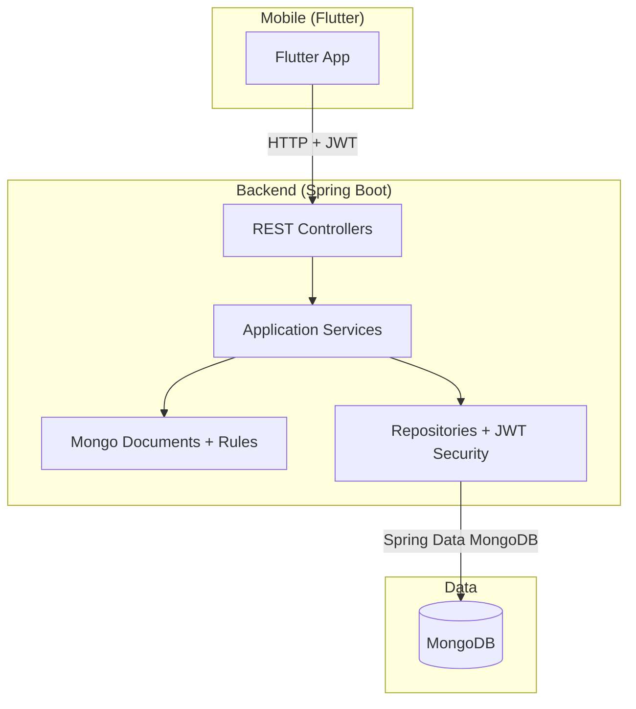
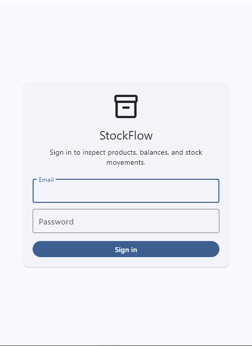
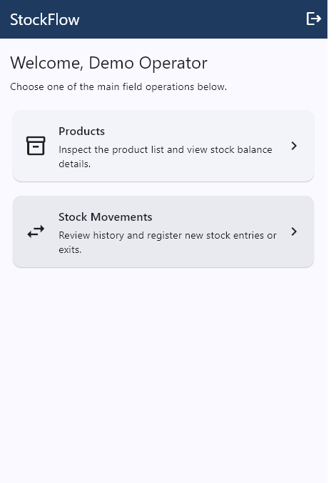
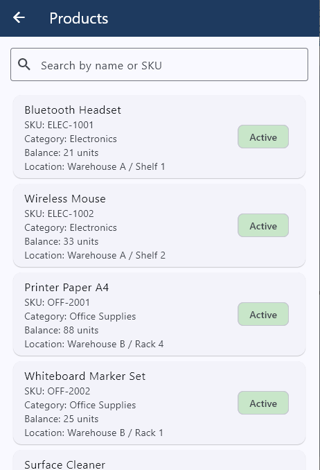
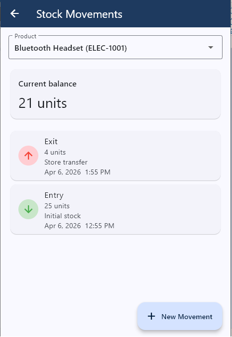
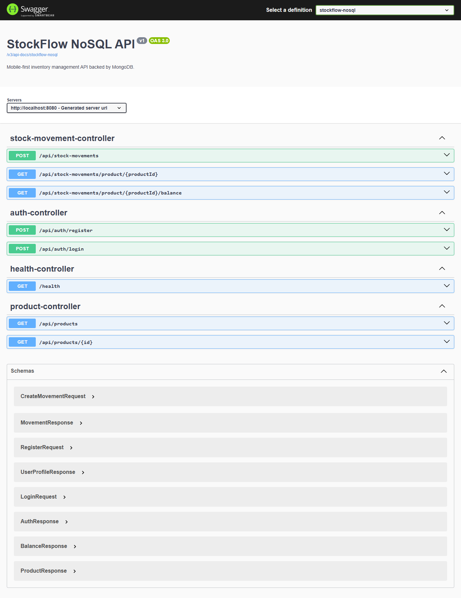

# StockFlow NoSQL / Mobile First

A mobile-first inventory management system built to solve the same business domain as `StockFlow.Core`, but with a different architectural strategy: **Spring Boot + MongoDB + Flutter**.

The goal of this repository is to demonstrate technical versatility, highlight NoSQL trade-offs, and show how the same inventory workflows can be delivered with a leaner, operator-focused mobile experience.

---

## Architecture



**Mobile-first architecture** — the Flutter app is the primary client, while the API is optimized for operator flows such as login, product lookup, balance inspection, and stock movement registration.

---

## Tech Stack

| Layer | Technology |
|-------|-----------|
| API | Spring Boot 3.3, Java 21 |
| Database | MongoDB 7 |
| Persistence | Spring Data MongoDB |
| Auth | JWT (`jjwt`) |
| Mobile | Flutter 3, Dart |
| Tests | JUnit 5, Mockito |
| API Docs | Springdoc OpenAPI / Swagger UI |
| Build | Maven 3.9 |

---

## Features

- user login and registration with JWT
- product catalog with `categoryName`, `location`, and `currentBalance`
- stock entry and exit with balance validation
- movement history by product
- real-time balance lookup for operators
- Swagger UI for quick API validation
- Flutter app for the mobile-first operational flow

> This project intentionally does **not** include a separate web frontend. The Flutter app is the client surface for the MVP.

---

## Screenshots

### Mobile App (Flutter)

| Login | Home |
|-------|------|
|  |  |

| Products | Stock Movements |
|----------|------------------|
|  |  |

### API (Swagger)



---

## Project Structure

```text
StockFlow.NoSQL.MobileFirst/
  backend/
    src/
      main/java/com/stockflow/nosql/
        api/            # REST controllers
        application/    # use cases and contracts
        config/         # security, OpenAPI, dev seed
        domain/         # Mongo documents and enums
        infrastructure/ # repositories and JWT helpers
      test/             # JUnit + Mockito tests
  mobile/
    stockflow_nosql/
      lib/
        core/           # API client, models, services, constants
        features/       # screens by feature
  docs/
    planning/
      TECHNICAL-SPEC.md
      images/
```

---

## Local Setup

### Prerequisites

- Java 21
- Maven 3.9+
- MongoDB 7+
- Flutter 3.x

### Backend

```bash
cd backend
mvn clean test
mvn "-Dspring-boot.run.profiles=dev" spring-boot:run
```

API available at `http://localhost:8080`  
Swagger UI at `http://localhost:8080/swagger-ui.html`

Demo credentials (after seed):

```text
demo@stockflow.local
Password123!
```

### Mobile

```bash
cd mobile/stockflow_nosql
flutter pub get
flutter run -d windows
flutter run -d chrome
flutter run
```

The base URL is configured in `lib/core/constants.dart`:
- **Android emulator** → `http://10.0.2.2:8080`
- **Windows / Chrome / Edge** → `http://localhost:8080`

---

## Testing

### Backend

```bash
cd backend
mvn clean test
```

### Mobile

```bash
cd mobile/stockflow_nosql
flutter analyze
flutter test
```

---

## CI

GitHub Actions validates the backend on every push to `main` and on pull requests:

- `mvn clean test`

---

## Architectural Comparison vs `StockFlow.Core`

| Decision | `StockFlow.Core` | `StockFlow.NoSQL.MobileFirst` | Reason |
|---------|-------------------|-------------------------------|--------|
| Balance | calculated via SQL aggregation | stored in the product document | faster mobile reads |
| Categories | normalized relational table | embedded `categoryName` string | avoids unnecessary joins |
| History | relational table + joins | separate Mongo collection | better fit for append-heavy records |
| Client surface | API + web + mobile | API + mobile | focused on operator usage |
| Stack | .NET / C# / PostgreSQL | Java / Spring Boot / MongoDB | demonstrates stack versatility |

---

## Portfolio Intent

This repository is designed to make the architectural comparison with `StockFlow.Core` explicit:

- same business problem
- different persistence model
- different trade-offs
- different delivery focus

It shows not only implementation ability, but also architectural reasoning.

